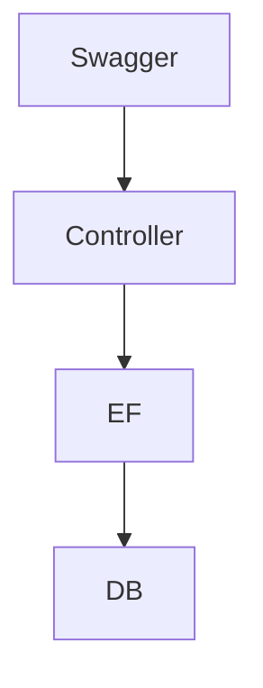

# 📈 Investment API

API desenvolvida em ASP.NET Core Web API com Entity Framework Core para a Sprint 4 da FIAP.

## ✅ Funcionalidades
- CRUD completo para transações
- Banco InMemory com seed inicial
- Consultas com LINQ
- Swagger para documentação
- Arquitetura simples e organizada

## 📌 Modelo de Dados
Entidade: Transaction

| Campo | Tipo | Descrição |
|-------|------|-----------|
| Id | int | Identificador |
| Asset | string | Código do ativo ex: PETR4 |
| Type | enum | 0 = Buy, 1 = Sell |
| Amount | decimal | Valor total |
| Quantity | int | Quantidade negociada |
| ExecutedAt | DateTime | Data da operação |

Enum:
```csharp
public enum TransactionType
{
    Buy,
    Sell
}
```

## 📡 Endpoints
| Método | Endpoint | Ação |
|--------|----------|-----|
| GET | /api/transactions | Listar |
| GET | /api/transactions/{id} | Buscar por ID |
| POST | /api/transactions | Criar |
| PUT | /api/transactions/{id} | Atualizar |
| DELETE | /api/transactions/{id} | Excluir |
| GET | /api/transactions/summary | Resumo (LINQ) |
| GET | /api/transactions/top/{n} | Top N valores |
| GET | /api/transactions/by-asset/{asset} | Filtrar por ativo |

## 🛠 Tecnologias
- .NET 8
- ASP.NET Core Web API
- Entity Framework Core
- Swagger

## ▶ Execução do Projeto
Pré-requisitos: .NET SDK 8

Passos:
```bash
dotnet restore
dotnet dev-certs https --trust
$env:ASPNETCORE_ENVIRONMENT="Development"
dotnet run
```

Swagger:
```
http://localhost:5000/swagger
```

## 🧪 Testes rápidos
```bash
curl http://localhost:5000/api/transactions
curl http://localhost:5000/api/transactions/summary
curl http://localhost:5000/api/transactions/top/2
```

## 📊 Diagrama da Arquitetura


## 📂 Estrutura
```
InvestmentApi/
 Controllers/
 Data/
 Models/
 Program.cs
 InvestmentApi.csproj
```

## Autor
Sprint 4 FIAP – C# Software Development
